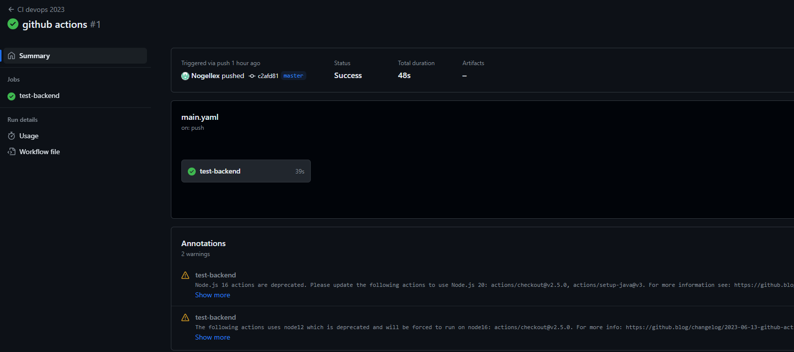

# DevOps

TP1(/home/tp/DevOps/TP1) :

## **Database** Postgres server:

### Dockerfile:

```docker
FROM postgres:14.1-alpine
ENV POSTGRES_DB=db \
POSTGRES_USER=usr \
POSTGRES_PASSWORD=pwd
```

### CMD Build:

```bash
docker build -t nogellex/db .
```

### Create Network:

```bash
docker network create app-network
```

### RUN without persistance:

```bash
docker run -p 15432:5432 --network app-network --name db nogellex/db
```

### Adminer:

```bash
docker run \
-p "8090:8080" \
--net=app-network \
--name=adminer \
-d \
adminer
```

### SQL files:

**CreateScheme.sql**

```sql
CREATE TABLE public.departments
(
 id      SERIAL      PRIMARY KEY,
 name    VARCHAR(20) NOT NULL
);

CREATE TABLE public.students
(
 id              SERIAL      PRIMARY KEY,
 department_id   INT         NOT NULL REFERENCES departments (id),
 first_name      VARCHAR(20) NOT NULL,
 last_name       VARCHAR(20) NOT NULL
);
```

**InsertData.sql**

```sql
INSERT INTO departments (name) VALUES ('IRC');
INSERT INTO departments (name) VALUES ('ETI');
INSERT INTO departments (name) VALUES ('CGP');

INSERT INTO students (department_id, first_name, last_name) VALUES (1, 'Eli', 'Copter');
INSERT INTO students (department_id, first_name, last_name) VALUES (2, 'Emma', 'Carena');
INSERT INTO students (department_id, first_name, last_name) VALUES (2, 'Jack', 'Uzzi');
INSERT INTO students (department_id, first_name, last_name) VALUES (3, 'Aude', 'Javel');
```

### Change dockerfile:

```docker
FROM postgres:14.1-alpine
ENV POSTGRES_DB=db \
POSTGRES_USER=usr \
POSTGRES_PASSWORD=pwd
COPY *.sql /docker-entrypoint-initdb.d
```

> rebuild and run
> 
- 1-1 Document your database container essentials: commands and Dockerfile.
    
    FROM : Create a new build stage from a base image.
    
    ENV : Set environment variables.
    
    COPY : Copy files and directories.
    
    ```docker
    docker build -t nogellex/db .
    docker network create app-network
    docker run -p 15432:5432 --network app-network --name db nogellex/db
    ```
    
    ⇒ Build, network creation and run 
    

### RUN with persistance:

```docker
docker run -p 15432:5432 --network app-network -v .//home/tp/DevOps/TP1/datasave:/var/lib/postgresql/data --name db nogellex/db
```

## **Backend API** JAVA :

**Main.java**

```java
public class Main {

   public static void main(String[] args) {
       System.out.println("Hello World!");
   }
}
```

```bash
javac Main.java
```

### Simple api:

**GreetingController:**

```java
package fr.takima.training.simpleapi.controller;

import org.springframework.web.bind.annotation.*;

import java.util.concurrent.atomic.AtomicLong;

@RestController
public class GreetingController {

   private static final String template = "Hello, %s!";
   private final AtomicLong counter = new AtomicLong();

   @GetMapping("/")
   public Greeting greeting(@RequestParam(value = "name", defaultValue = "World") String name) {
       return new Greeting(counter.incrementAndGet(), String.format(template, name));
   }

   record Greeting(long id, String content) {}

}
```

**Dockerfile:**

```docker
# Build
FROM maven:3.8.6-amazoncorretto-17 AS myapp-build
ENV MYAPP_HOME /opt/myapp
WORKDIR $MYAPP_HOME
COPY pom.xml .
COPY src ./src
RUN mvn package -DskipTests

# Run
FROM amazoncorretto:17
ENV MYAPP_HOME /opt/myapp
WORKDIR $MYAPP_HOME
COPY --from=myapp-build $MYAPP_HOME/target/*.jar $MYAPP_HOME/myapp.jar

ENTRYPOINT java -jar myapp.jar
```

- 1-2 Why do we need a multistage build? And explain each step of this dockerfile.
    
    We need a multistage build to save  more ressources. 
    
    For exemple in a java code in a container :
    
    Multistage build will take a jdk and a jre, use the jdk to compile and then get rid of it to keep only the essential part witch is the .jar and the jre to execute it.
    
    Contrary to a classic build which will juste take and keep all the resources from build the execution.
    

```docker
docker build -t nogellex/java_d_api . -f s_api.dockerfile
docker run -p 8080:8080 --network app-network --name java_s_api nogellex/java_s_api
```

### **Backend API:**

**YML:**

```yaml
spring:
  jpa:
    properties:
      hibernate:
        jdbc:
          lob:
            non_contextual_creation: true
    generate-ddl: false
    open-in-view: true
  datasource:
    url: jdbc:postgresql://db:5432/db
    username: usr
    password: pwd
    driver-class-name: org.postgresql.Driver
management:
  server:
    add-application-context-header: false
  endpoints:
    web:
      exposure:
        include: health,info,env,metrics,beans,configprops
```

```docker
docker build -t nogellex/java_b_api . -f b_api.dockerfile
docker run -p 8080:8080 --network app-network --name java_b_api nogellex/java_b_api
```

## **Http server :**

### Reverse proxy:

**httpd.conf:**

```docker
<VirtualHost *:80>
ProxyPreserveHost On
ProxyPass / http://YOUR_BACKEND_LINK:8080/
ProxyPassReverse / http://YOUR_BACKEND_LINK:8080/
</VirtualHost>
LoadModule proxy_module modules/mod_proxy.so
LoadModule proxy_http_module modules/mod_proxy_http.so
```

**Dockerfile:**

```docker
FROM httpd:2.4
COPY ./httpd.conf /usr/local/apache2/conf/httpd-custom.conf
COPY ./public-html/ /usr/local/apache2/htdocs/
RUN echo "Include ./conf/httpd-custom.conf" >> /usr/local/apache2/conf/httpd.conf
```

**docker-compose:**

```yaml
version: '3.8'

services:
  backend:
    container_name: java_b_api
    build:
      context: TP1_2/simple-api-student-main
    networks:
      - tp1
    depends_on:
      - database

  database:
    container_name: db
    build: TP1
    networks:
      - tp1
    volumes:
      - db:/var/lib/postgresql/data

  httpd:
    build: TP1_http
    ports:
      - 80:80
    networks:
      - tp1
    depends_on:
      - backend

networks:
  tp1:
volumes:
  db:
```

- 1-3 Document docker-compose most important commands.
    
    ```bash
    docker compose build
    ```
    
    => to build your containers and gather all informations necessary
    
    ```bash
    docker compose up -d
    ```
    
    => to wake up your builded container and run them
    
- 1-4 Document your docker-compose file.
    
    We use 3 services with 1 network and a volume for the database. Each service is link to a dockerfile, a context, a network and also if necessary a dependence.
    

**After you can build and up your docker :**

```bash
docker composer build && docker compose up -d
```

### Publish :

```bash
docker login -u nogellex
docker tag devops-database nogellex/tp1:1.0
docker push nogellex/tp1:1.0
```

# TP2

- 2-1 What are testcontainers?

  Testcontainers are lightweight libraries with an API for completing integration test with services inside containers

## CI
**Create a .github/workflows directory in your repository on GitHub.**
**main.yaml:**
```yaml
name: CI devops 2023
on:
  #to begin you want to launch this job in main and develop
  push:
    branches: [master, develop]
  pull_request:

jobs:
  test-backend:
    runs-on: ubuntu-22.04
    steps:
      #checkout your github code using actions/checkout@v2.5.0
      - uses: actions/checkout@v2.5.0

      #do the same with another action (actions/setup-java@v3) that enable to setup jdk 17
      - name: Set up JDK 17
        uses: actions/setup-java@v3
        with:
          java-version: 17
          distribution: 'temurin'

      #finally build your app with the latest command
      - name: Build and test with Maven
        run: mvn clean verify --file TP1_2/simple-api-student-main/pom.xml
```


## CD


**add in main.yaml:**
```yaml
  # define job to build and publish docker image
  build-and-push-docker-image:
    needs: test-backend
    # run only when code is compiling and tests are passing
    runs-on: ubuntu-22.04

    # steps to perform in job
    steps:
      - name: Checkout code
        uses: actions/checkout@v2.5.0

      - name: Login to DockerHub
        run: docker login -u ${{ secrets.DOCKERHUB_USERNAME }} -p ${{ secrets.DOCKERHUB_TOKEN }}

      - name: Build image and push backend
        uses: docker/build-push-action@v3
        with:
          # relative path to the place where source code with Dockerfile is located
          context: ./TP1_2/simple-api-student-main
          # Note: tags has to be all lower-case
          tags: ${{secrets.DOCKERHUB_USERNAME}}/tp2-devops-simple-api-main:latest
          # build on feature branches, push only on main branch
          push: ${{ github.ref == 'refs/heads/master' }}

      - name: Build image and push database
        uses: docker/build-push-action@v3
        with:
          context: ./TP1

          tags: ${{secrets.DOCKERHUB_USERNAME}}/tp2-database:latest
          push: ${{ github.ref == 'refs/heads/master' }}

      - name: Build image and push httpd
        uses: docker/build-push-action@v3
        with:
          context: ./TP1_http

          tags: ${{secrets.DOCKERHUB_USERNAME}}/tp2-http:latest
          push: ${{ github.ref == 'refs/heads/master' }}
```

## Sonar

**Change**
`run: mvn clean verify --file TP1_2/simple-api-student-main/pom.xml`
**by**
`run: mvn -B verify sonar:sonar -Dsonar.projectKey=Nogellex_DevOps -Dsonar.organization=nogellex -Dsonar.host.url=https://sonarcloud.io -Dsonar.login=${{ secrets.SONAR_TOKEN }}  --file ./TP1_2/simple-api-student-main/pom.xml`
**in main.yaml**


SPLIT


# TP3 Ansible
**Inventories**

**setup.yml**
```yaml
all:
 vars:
   ansible_user: centos
   ansible_ssh_private_key_file: /home/tp/DevOps/id_rsa
 children:
   prod:
     hosts: leo.barbier.takima.cloud
```
- 3-1 Document your inventory and base commands
  
**Facts**

**Playbooks**
```yaml
- hosts: all
  gather_facts: false
  become: true

  tasks:
   - name: Test connection
     ping:

```


**advanced playbooks**
```yaml
- hosts: all
  gather_facts: false
  become: true

# Install Docker
  tasks:

  - name: Install device-mapper-persistent-data
    yum:
      name: device-mapper-persistent-data
      state: latest

  - name: Install lvm2
    yum:
      name: lvm2
      state: latest

  - name: add repo docker
    command:
      cmd: sudo yum-config-manager --add-repo=https://download.docker.com/linux/centos/docker-ce.repo

  - name: Install Docker
    yum:
      name: docker-ce
      state: present

  - name: Install python3
    yum:
      name: python3
      state: present

  - name: Install docker with Python 3
    pip:
      name: docker
      executable: pip3
    vars:
      ansible_python_interpreter: /usr/bin/python3

  - name: Make sure Docker is running
    service: name=docker state=started
    tags: docker

```

**using roles**
```bash
ansible-galaxy init roles/docker
```

- 3-2 Document your playbook


**Deploy your App**
**Exemple Launch proxy**
```yaml
---
# tasks file for roles/launch-proxy
- name: Run Proxy
  community.docker.docker_container:
    name: https-1
    image: nogellex/tp2-http:latest
    ports:
      - "80:80"
    networks:
      - name: tp1
```
**Front**
Add front and a role
```yaml
---
# tasks file for roles/launch-proxy
- name: Run Proxy
  community.docker.docker_container:
    name: https-1
    image: nogellex/tp2-http:latest
    ports:
      - "80:80"
      - "8080:8080"
    networks:
      - name: tp1
    pull: true
    recreate: true
```
Modification httpd.conf
```
<VirtualHost *:80>
    ServerName localhost
    ProxyPreserveHost On
    ProxyPass / http://front:80/
    ProxyPassReverse / http://front:80/
</VirtualHost>

Listen 8080
<VirtualHost *:8080>
    ServerName localhost
    ProxyPreserveHost On
    ProxyPass / http://java_b_api:8080/
    ProxyPassReverse / http://java_b_api:8080/
</VirtualHost>

LoadModule proxy_module modules/mod_proxy.so
LoadModule proxy_http_module modules/mod_proxy_http.so
```
Add image in workflows
```yaml
      - name: Build image and push front
        uses: docker/build-push-action@v3
        with:
          context: ./devops-front-main

          tags: ${{secrets.DOCKERHUB_USERNAME}}/tp2-front:latest
          push: ${{ github.ref == 'refs/heads/master' }}
```


CICD
````yaml
name: CICD ansible

on:
  workflow_run:
    workflows:
      - push
    types:
      - completed
    branches:
      - master

jobs:
  deploy-to-ansible:
    if: ${{ github.event.workflow_run.conclusion == 'success' }}
    runs-on: ubuntu-22.04

    steps:
      - name: Checkout code
        uses: actions/checkout@v2.5.0

      - name: Install Python + Pip + Ansible
        run: sudo apt install python3-pip && sudo apt install ansible

      - name: Setup SSH key
        run: |
          mkdir -p ~/.ssh
          ssh-keyscan -H leo.barbier.takima.cloud >> ~/.ssh/known_hosts
          echo "${{secrets.SSH_PRIVATE_KEY}}" > ~/id_rsa
          chmod 600 ~/id_rsa
        env:
          SSH_PRIVATE_KEY: ${{secrets.SSH_PRIVATE_KEY}}

      - name: Deploy application
        run: ansible-playbook -i ./ansible/inventories/setup.yml ./ansible/playbook.yml
````